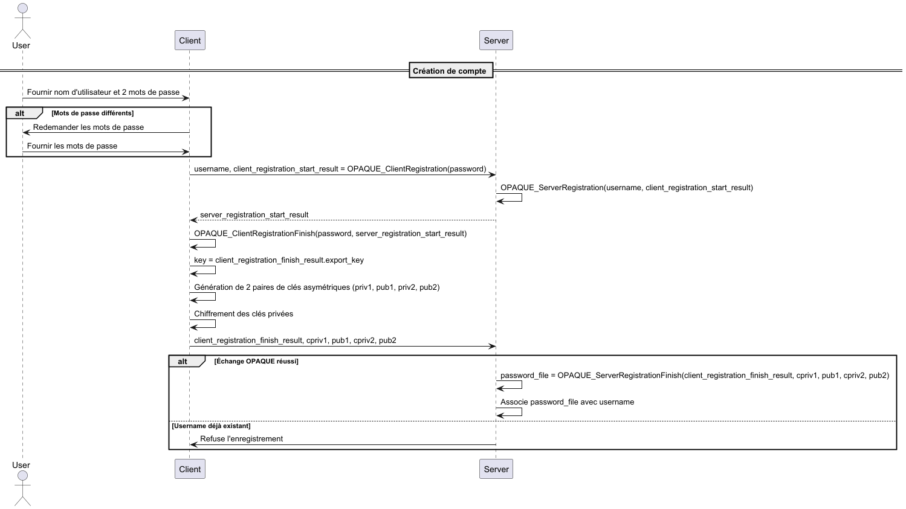
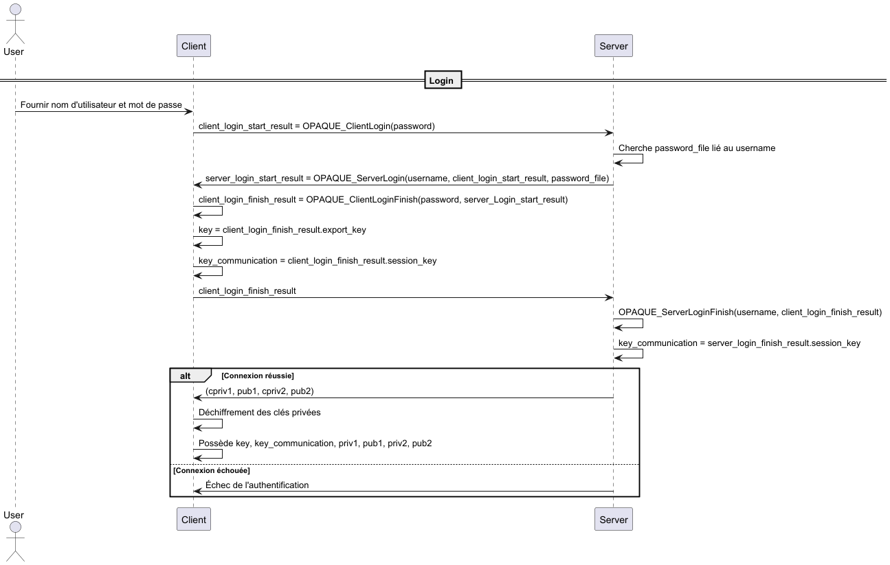
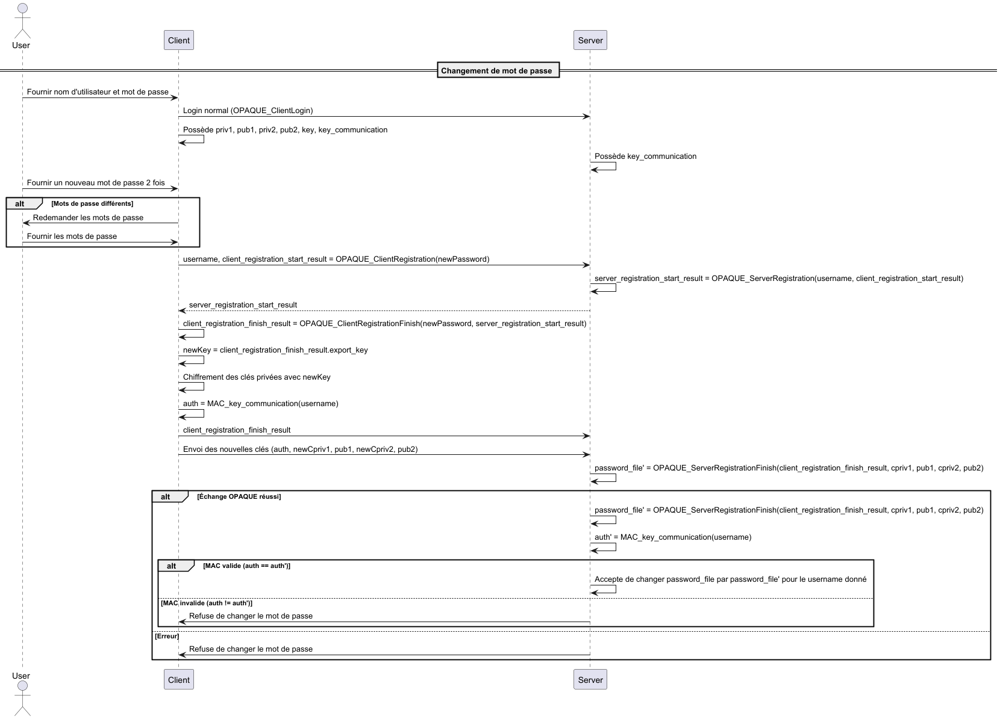
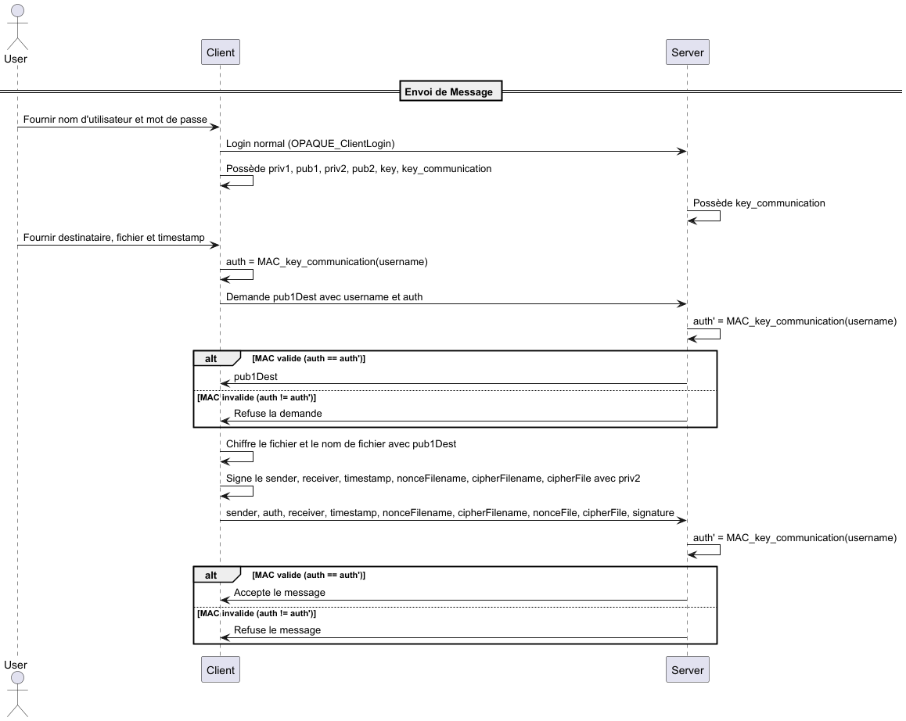
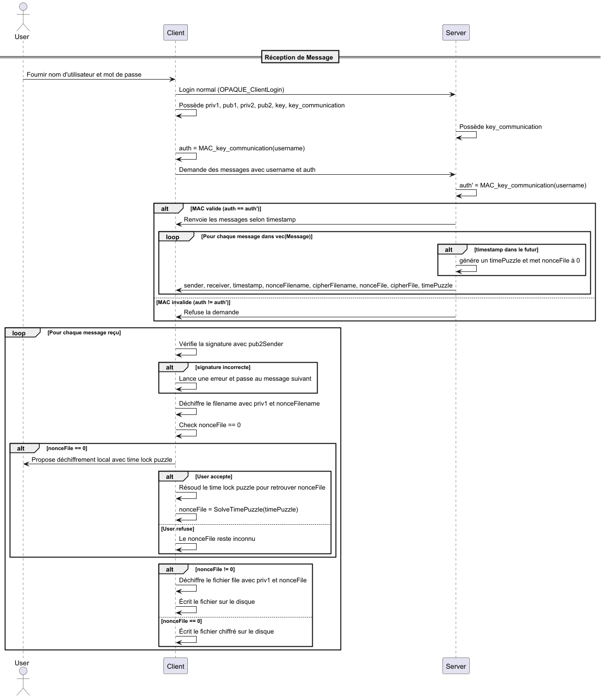

# CAA-Project Ferrara Justin

## Niveau de sécurité choisi
Dans ce projet, j'ai choisi de partir sur un niveau de sécurité de 256 bits pour la cryptographie symétriques. J'ai ensuite utilisé [keylength.com](https://www.keylength.com/en/4/) avec les recommandations du NIST de 2020 pour dresser la liste suivante :
- Taille de clés pour la cryptographie symétrique: 256 bits
- Taille des hash : 512 bits
- Taille clés pour courbes elliptiques : 512 bits

>Note: comme Libsoduim ne prend pas en charge toutes les tailles de clés possibles, certaine taille de clés sont un peu plus petite dans l'implémentation. Pour plus d'information pour les tailles de clés utilisées dans l'implémentation, voire le fichier [consts.rs](./src/consts.rs).
## Consignes
Les consignes sont disponibles dans le fichier [mini_project_2425.pdf](./mini_project_2425.pdf).

## Modélisation des adversaires
La modélisation des adversaires est faite dans la consigne qui se trouve dans ce fichier [mini_project_2425.pdf](./mini_project_2425.pdf).

## Légendes
- utilisateur : personne physique utilisant la machine
- client : ordinateur, machine que l'utilisateur utilise
- serveur : serveur
## Algorithmes utilisés
- OPAQUE pour obtenir 2 clé symétrique et authentifier le client. Une dérivée du mot de passe nommée `key` et une partagée entre le client et le serveur pour authentifier le client, nommée `key_communication`. Les algorithmes utilisés pas OPAQUE sont les suivants :
	- `Ristretto255` pour l'OPRF (Oblivious Pseudo-Random Function)
	- `Ristretto255` pour le groupe KE
	- `Triple D-H` pour l'échange de clés
	- `Argon2` pour la KSF avec les paramètres par défaut
- `XSalsa20` avec `Poly1305` comme mac pour le chiffrement symétrique des clés asymétriques. Cette combinaison d'algorithme sera nommée `SymEnc` ou `SymDec`
- `X25519`,` XSalsa20` et `Poly1305` pour le chiffrement hybride et la signature de certaines parties du message. Cette combinaison d'algorithme sera nommée `HybEnc` ou `HybDec`
- `EdDSA` pour la signature du message.
- `HMAC-SHA512-256` comme MAC. Pour authentifier le client auprès du serveur après un login réussi.
- `TLS 1.3` pour protéger la confidentialité, l'intégrité et l'authenticité de toutes les communication entre le client et le serveur.

## Gestion des clés
- Chaque utilisateur possède un mot de passe.
- Chaque utilisateur possède 1 clé symétrique de 256 bits nommée `key` dérivée du mot de passe. Cette clé est disponible à la fin de l'échange OPAQUE avec le serveur. Elle est déterministe et sert à chiffrer et déchiffrer les clés privées asymétriques.
- Chaque utilisateur possède 1 clé symétrique de 256 bits nommée `key_communication`. Dérivée de l'échange OPAQUE avec le serveur, elle est non-déterministe. Elle sert à authentifier le client auprès du serveur pour des actions nécessitant une authentification, comme l'envoi de messages.
- Chaque utilisateur possède une paire de clé asymétrique de 512 bits pour le chiffrement des messages (priv1, pub1).
- Chaque utilisateur possède une paire de clé asymétrique de 512 bits pour la signature des messages (priv2, pub2).

## Tailles des clés
### OPAQUE
- La sortie de OPAQUE pour la clé `key` est de 512 bits
- La deuxième sortie de OPAQUE pour la clé `key_communication` est de 512 bits
### XSalsa20 et Poly1305 (SymEnc / SymDec)
- La clé symétrique de `XSalsa20` est de 256 bits
- Le nonce de `XSalsa20` est des 192 bits
- La longueur du MAC `Poly1305` est de 256 bits
### X25519, XSalsa20 et Poly1305 (HybEnc / HybDec)
- La taille de la clé asymétrique de `X25519` est de 512 bits
- La clé symétrique de `XSalsa20` est de 256 bits
- Le nonce de `XSalsa20` est des 192 bits
- La longueur du MAC `Poly1305` est de 256 bits
### Signature
- `EdDSA` utilise une paire clés asymétriques de 512 bits.
### MAC
- `HMAC-SHA512-256` utilise une paire clés symétriques de 256 bits. La taille du MAC est de 256 bits.

## Considérations
### Nonce
Tous les nonces utilisés dans ce programme font 192 bits et sont choisis de manière aléatoire. En sachant cela, on peut calculer que la probabilité de collision sur un nonce reste acceptable : 

$$
1 - e^{-\frac{n^2}{2d}} < 2^{-32}
$$

Avec `n` le nombre de messages possible avant que la probabilité soit supérieure à `2^-32` et `d` l'espace total, dans notre cas 192 bits. En résolvant l'équation on obtient :

$$
n = 80
$$
On peut donc envoyer jusqu'à `2^80` messages pour le chiffrement hybride ce qui est un nombre conséquent dans notre cas.

En faisant un rapide calcul, je me rends compte que si un utilisateur envoie un message toutes les millisecondes, il lui faudra environ 38'000 milliards d'années pour atteindre les `2^80` message. C'est pourquoi dans ce programme, je ne garde pas un historique du nombre de messages envoyés par utilisateur pour faire une rotation des clés si le nombre de messages envoyés devient trop grand. Car ce nombre est impossible à atteindre dans cette situation.

### Taille du fichier max
Dans ce cas, j'utilise `XSalsa20` pour chiffrer les fichiers. `XSalsa20` utilise un compte interne de bloc de 64 bits. En sachant que chaque bloc fait 512 bits, cela veut dire que on peut chiffrer un fichier de cette taille:

$$
tailleMaxBit= 2^{64} * 2^{9} = 2^{73}
$$

$$
tailleMaxByte = 2^{64} * 2^{9} / 2^{3} = 2^{70}
$$

La taille max pour chiffrer un fichier est donc de `2^70` bytes.

Je constate donc qu'il n'y aura jamais un fichier de cette taille à chiffrer, car c'est impossible à stocker sur une machine client qui correspond à notre cas d'utilisation. C'est pourquoi dans le code je ne contrôle pas la taille du fichier avant de commencer à le chiffrer.

### Gestion de l'aléatoire
J'ai besoins de générer des flus de bits aléatoires dans ce projet, notamment pour la génération des nonces et lors de l'échange OPAQUE. Pour ce faire, j'utilise la fonction `randombytes_buf`. Cette fonction utilise un PRNG ou TRNG en fonction de l'os utilisé:
- `RtlGenRandom()` pour Windows
- `/dev/urandom` sur Linux
- `arc4random()` ou `getrandom` pour FreeBSD
- etc.

## Implémentation
L'implémentation a été effectuée en Rust et les principales librairies utilisées sont les suivantes :
- `opaque_ke`  pour OPAQUE
- `libsodium-sys-stable` pour les opérations cryptographiques
- `inquire` pour réaliser le CLI

## Création de compte
- L'utilisateur renseigne un nom d'utilisateur et 2 mots de passe identiques.
- Le client vérifie que le premier mot de passe est le même que le second, si ce n'est pas le cas, il redemande un mot de passe.
- Le client fait un échange OPAQUE avec le serveur :

$$
Client:
client\_registration\_start\_result = OPAQUE_{ClientRegistration}(password)
$$

$$
Server:
server\_registration\_start\_result  = OPAQUE_{ServerRegistration}(username, client\_registration\_start\_result)
$$

$$
Client: client\_registration\_finish\_result = OPAQUE_{ClientRegistrationFinish}(password, server\_registration\_start\_result)
$$

$$
Client: key = client\_registration\_finish\_result.export\_key
$$

- Le client génère 2 clés asymétriques de 512 bits 

$$
priv1 = random[0..512]
$$

$$
pub1 = priv1*G
$$

$$
priv2 = random[0..512]
$$

$$
pub2 = priv2*G
$$
- Le client chiffre priv1 et priv2 avec `SymEnc` en utilisant sa clé `key`, ce qui donne :

$$
IV1 = random[0..192]
$$

$$
cpriv1||tag1 = SymEnc_{key}(IV1, priv1)
$$

$$
IV2 = random[0..192]
$$

$$
cpriv2||tag2 = SymEnc_{key}(IV2, priv2)
$$

- Le client termine l'échange OPAQUE en envoyant également les clés asymétriques `cpriv1`, `pub1`, `cpriv2` et `pub2` au serveur :
$$
Server:
password\_file  = OPAQUE_{ServerRegistrationFinish}(client\_registration\_finish\_result)
$$
- Le serveur associe `password_file` avec le username et les clés asymétrique uniquement si l'échange OPAQUE a réussi.
- S'il existe déjà un username dans la base de données, le server refuse d'écrire `password_file`.

> Note: pour le cas où le username existe déjà, voire la partie `Changement de mot de passe` pour plus de détail.

### Schéma récapitulatif

## Login
- Le client renseigne son nom d'utilisateur et son mot de passe.
- Le client fait un échange OPAQUE avec le serveur :

$$
Client:
client\_login\_start\_result = OPAQUE_{ClientLogin}(password)
$$

- Le serveur va chercher le password file en lien avec le username

$$
Server:
server\_login\_start\_result  = OPAQUE_{ServerLogin}(username, client\_login\_start\_result, password\_file)
$$

$$
Client: client\_login\_finish\_result = OPAQUE_{ClientLoginFinish}(password, server\_login\_start\_result)
$$

$$
Client: key = client\_login\_finish\_result.export\_key\_key
$$

$$
Client: key\_communication = client\_login\_finish\_result.session\_key
$$

$$
Server:
server\_login\_finish\_result = OPAQUE_{ServerLoginFinish}(client\_login\_finish\_result)
$$

$$
Server: key\_communication = server\_login\_finish\_result.session\_key
$$

- Le serveur renvoie (cpriv1, pub1, cpriv2, pub2) au client à la fin de la connexion OPAQUE si la connexion a réussi.
- Le client et le serveur on donc un secret partagé non-déterministe `key_communication` à la fin de l'échange OPAQUE.
- Le client déchiffre cpriv1 et cpriv2 avec SymDec :

$$
priv1 = SymDec_{key}(cpriv1||tag1||IV1)
$$

$$
priv2 = SymDec_{key}(cpriv2||tag2||IV2)
$$
- Le client contrôle que tag1 et tag2 sont correct
- Le client contrôle cette égalité pour s'assurer que la clé publique n'a pas été modifiée :

$$
priv1 * G = pub1
$$

- Le client possède donc :
	- key
	- key_communication
	- priv1
	- pub1
	- priv2
	- pub2

### Schéma récapitulatif

## Changement de mot de passe
- Le client fait un login normal.
- Le client possède donc priv1, pub1, priv2, pub2, key, key_communication.
- L'utilisateur renseigne son nouveau mot de passe.
- Le client fait un échange OPAQUE comme dans registration avec le serveur :

$$
newKey = OPAQUE_{register}
$$

- Le client chiffre priv1 et priv2 avec SymEnc et newKey :

$$
IV1 = random[0..192]
$$

$$
cpriv1||tag1 = SymEnc_{newKey}(IV1, priv1)
$$

$$
IV2 = random[0..192]
$$

$$
cpriv2||tag2 = SymEnc_{newKey}(IV2, priv2)
$$

- Le client envoie au server les nouvelles clés comme dans la partie registration `ServerFinishRegistration`.

> On notera que comme l'utilisateur existe déjà dans la base de données, le serveur vérifie que l'utilisateur est bien en possession de la clé `key_communication` en vérifiant le MAC du nom d'utilisateur :

$$
auth = MAC_{key\_communication}(username)
$$

> Pour plus de détail sur cette partie, voire le paragraphe [Authentification](#Authentification).

- Si le MAC est juste, alors le serveur accepte de changer le `password_file` dans la base de données, à la fin de l'échange dans server_registration_finish.

### Schéma récapitulatif

## Envoi de Message
- Le client fait un login normal.
- Le client possède donc priv1, pub1, priv2, pub2, key, key_communication.
- L'utilisateur rentre le destinataire, le fichier à envoyer et le timestamp auquel le destinataire pourra l'ouvrir.
- Le client génère le MAC :

$$
auth = MAC_{key\_communication}(username)
$$

> Pour plus de détail sur cette partie, voire le paragraphe [Authentification](#Authentification).

- Le client demande la clé publique du destinataire du Message au serveur en envoyant son username et le MAC.
- Le serveur vérifie le MAC avec sa clé `key_communication` et renvoie la clé publique correspondante `pub1Dest`.
- Le client utilise `HybEnc` pour chiffrer le fichier et le nom de fichier en utilisant la clé publique du destinataire :

$$
nonceFilename = random[0..192]
$$

$$
nonceFile = random[0..192]
$$

$$
cipherFilename = HybEnc_{pub1Dest, priv1}(filename, nonceFilename)
$$

$$
cipherFile = HybEnc_{pub1Dest, priv1}(file, nonceFile)
$$

- Le client signe le fichier chiffré, le nom de fichier chiffré, le nonceFilename, le sender, le receiver et la date autorisée d'ouverture du message avec priv2 :
$$
signature = EdDSA_{priv2}(sender, receiver, timestamp, nonceFilename, cipherFilename, cipherFile)
$$
- Le client vérifie si la signature est correcte
- Le client envoie au serveur :
	- sender
	- MAC (sender)
	- receiver
	- timestamp
	- nonceFilename
	- cipherFilename
	- nonceFile
	- cipherFile
	- signature
- Le serveur accepte de recevoir le message si le MAC est correct.

### Schéma récapitulatif

## Réception de Message
- Le client fait un login normal.
- Le client possède donc priv1, pub1, priv2, pub2, key, key_communication.
- Le client fait une demande pour recevoir ses messages en envoyant son username avec le MAC :
 
 $$
auth = MAC_{key\_communication}(username)
$$

> Pour plus de détail sur cette partie, voire le paragraphe [Authentification](#Authentification).

- Le serveur vérifie si auth est juste, si c'est le cas, il renvoie tous les messages au destinataire de la manière suivante:
	- Si le timestamp du message est dans le passé alors le serveur envoie :
$$
sender, receiver, timestamp, nonceFilename, cipherFilename, nonceFile, cipherFile, timePuzzle
$$
	- Si le timestamp est dans le futur, le serveur envoie tout mais met `nonceFile` à 0:
$$
sender, receiver, timestamp, nonceFilename, cipherFilename, 0, cipherFile, timePuzzle
$$
> Dans le cas où le client a le droit de déchiffrer le message et que donc il est en possession du nonceFile, le serveur renvoie quand même un timePuzzle qui ne sert à rien. C'est pour simplifier l'implémentation.

- Le client reçoit les messages du serveur. Pour chaque message, le client fait les opérations suivantes :
- Le client vérifie que la signature du Message est correcte :

$$
signature' = EdDSA_{pub2Sender}(sender, receiver, timestamp, nonceFilename, cipherFilename, cipherFile)
$$

$$
signature \stackrel{?}{=} siganture'
$$

- Si la signature est correcte, alors le client continue. Sinon il s'arrête.
- Le client déchiffre le filename :

$$
filename = HybDec_{priv1, pub1Send}(cipherFilename, nonceFilename)
$$

- Le client check si le nonceFile vaut 0:
	- si c'est le cas le client propose à l'utilisateur de déchiffrer localement en utilisant le time lock puzzle. Le client va donc ensuite commencer les calculs pour retrouver le nonceFile. Le nonceFile sera trouvé quand le time lock puzzle sera résolu, ce qui devrait prendre le même temps que d'attendre que le temps s'écoule et demander le nonceFile au serveur.
	- sinon le client écrit sur le disque le fichier chiffré sans pouvoir le déchiffrer. Il peut déjà mettre le bon nom de fichier comme il l'a en sa possession. Il peut également indiquer la date à laquelle le message pourra être déchiffré car la date n'est pas chiffrée.
- Si le nonceFile ne vaut pas 0, le client déchiffre le Message m :

$$
file = HybDec_{priv1, pub1Send}(cipherFile, nonceFile)
$$

>Note : Chaque message est enregistré sur la machine dans un dossier avec l'arborescence suivante : `recievedMessages/username`. Avec comme username le nom d'utilisateur de l'utilisateur connecté. Si le dossier avec le bon nom d'utilisateur n'existe pas, le programme va le créer automatiquement.
### Schéma récapitulatif

## Authentification
Pour certaines requêtes, comme la réception des messages, le client a besoins d'être authentifié auprès du serveur pour que la requête soit acceptée. Je l'ai fait de cette manière :

- Le client génère un MAC nommé ici `auth` en utilisant sa clé `key_communication` générée pendant l'échange OPAQUE et son nom d'utilisateur :

$$
auth = MAC_{key\_communication}(username)
$$

- Le client fait une requête au serveur qui nécessite une authentification et fourni en même temps `auth`.
- Le serveur vérifie ensuite `auth` de son côté avec sa clé `key_communication` :

$$
auth' = MAC_{key\_communication}(username)
$$

$$
auth' \stackrel{?}{=} auth
$$

- Le MAC est juste si :

$$
auth' = auth
$$

- Si le MAC est juste, cela veut dire que l'utilisateur démontre qu'il est bien en possession de la clé `key_communication` définie durant l'échange OPAQUE effectué pour le login. Cela veut dire qu'il s'est connecté de manière correcte. Le serveur accepte donc la requête demandée par le client.
## Protections mises en place contre :
- **Adversaires Actifs** :   
  - **Signatures Numériques** : Les messages sont signés avec les clés privées des clients, empêchant ainsi la répudiation et garantissant l'authenticité des messages. 
  - **Utilisation de TLS 1.3** : Toutes les communications entre le client et le serveur sont sécurisées avec TLS 1.3, protégeant les données en transit contre les interceptions et les modifications.
  - **Utilisation de OPAQUE** : Permet d'éviter les attaques à sel connu et d'authentifier les actions effectuées par le client auprès du serveur. Permettant ainsi d'authoriser uniquement les utilisateurs connectés à envoyer des messages par exemple.
- **Serveur Honnête mais Curieux** :   
  -  **Chiffrement de Bout en Bout** : Les messages sont chiffrés de bout en bout en utilisant du chiffrement hybride. Ce qui empêche le serveur d'en lire le contenu.
  - **Stockage Sécurisé des Clés** : Les clés privées des utilisateurs sont stockées chiffrées sur le serveur, empêchant leur utilisation non autorisée, même en cas de compromission du serveur.
  - **Échange de clés authentifié** : L'utilisation de OPAQUE permet d'authentifier les utilisateurs, sans sortir le sel du serveur et sans transmettre le hash au serveur. Cela permet d'éviter les attaques à sel connu.

## Bonus
### OPAQUE
OPAQUE est utilisé ici pour divers aspects:
- Authentification du client avec le mot de passe.
- Mitiger les attaques par sel connu.
- Dérivation d'une clé déterministe à partir du mot de passe nommée ici `key`. Cette clé est utilisée pour stocker les clés privées du client de manière sécurisée sur le serveur.
- Dérivation d'une clé de session disponible côté client et serveur pour authentifier les actions du client. Cette clé est non-déterministe et est nommée dans ce rapport `key_communication`.

>Note: Avec `opaque_ke` qui est la librairie Rust utilisée dans ce projet pour OPAQUE, il est possible de checker l'authenticité du serveur en enregistrant sa clé publique à l'étape de la création de compte. Il faut ensuite stocker cette clé publique sur le client et la vérifier à chaque login pour contrôler que c'est la même. Comme l'implémentation proposé ici fait un mock du serveur, sans partie réseau, il n'est pas nécessaire de fait cette vérification.

### Time lock puzzle
Pour permettre de déchiffrer un message au client, sans accès au serveur après l'avoir téléchargé avant la date d'ouverture, j'ai utilisé un time lock puzzle.

Le time lock puzzle permet de trouver le nonceFile de manière complétement offline et ainsi de déchiffrer le fichier. Comme notre nonce fait 24 bytes et que la librairie utilisée permet de faire des time lock puzzle sur des entiers de 8 bytes, j'ai fait 3 time lock puzzle.

Un seul time lock puzzle doit prendre le temps nécessaire jusqu'à la date de libération du fichier. Comme on en a 3, il faut les résoudre en parallèle sur la machine cliente.

> Note: Il est très important de noter qu'il faut résoudre les 3 puzzle en parallèle et non en série. En effet, si on les résout en série, une implémentation malveillant du client qui les résoudrais en parallèle permettrait de résoudre les time lock puzzle 3 fois plus vite.
#### Paramètres
- Le lambda choisi dans mon cas est 256. Car c'est le niveau de sécurité choisi pour les clés symétriques.
- Le `TIME_HARDNESS` a été mis à 340'000, ce qui correspond à un temps de 1 secondes pour résoudre le puzzle avec un lambda de 256 sur ma machine. Le `TIME_HARDNESS` a été calculé dans le code dans le fichier [/src/server.rs](./src/server.rs). Pour le recalculer, il suffit de décommenter le code et ajuster la constante `TIME_HARDNESS` pour que cela corresponde au temps voulu en faisant une règle de trois.
#### Points à prendre en compte
- Trouver le nonceFile à partir du time lock puzzle est une opération qui doit se faire sans s'arrêter et qui peut donc paralyser la machine client
- Trouver le nonceFile à partir du time lock puzzle est une opération qui prend beaucoup de ressources machines.
- La vitesse pour trouver nonceFile dépend de la puissance de calcul de la machine cliente. On peut avoir des différences significative entre la meilleure machine du marché et la pire. C'est pourquoi  `TIME_HARDNESS` doit être choisi de manière correcte pour correspondre au client qui résoudra le time lock puzzle. Dans ce cas, comme les messages sont envoyé et reçu sur la même machine, le  `TIME_HARDNESS` reste le même partout.
- La génération du time lock puzzle côté serveur peu prendre un peu de temps. C'est pourquoi il y a un petit délai quand on veut recevoir les messages, cela correspond au temps que prend le serveur à générer un time lock puzzle différent pour chaque message qui ont pas encore le droit d'être ouvert.