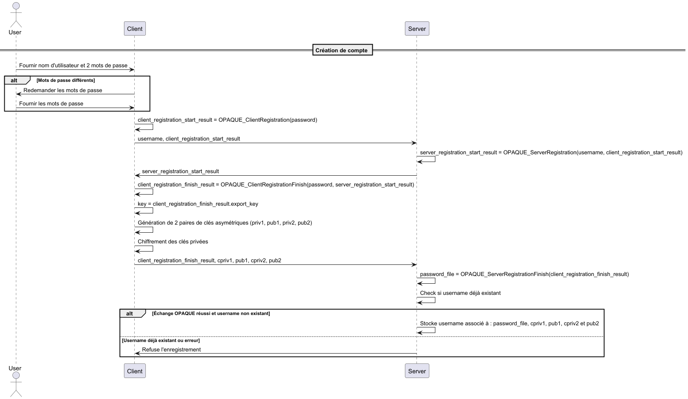
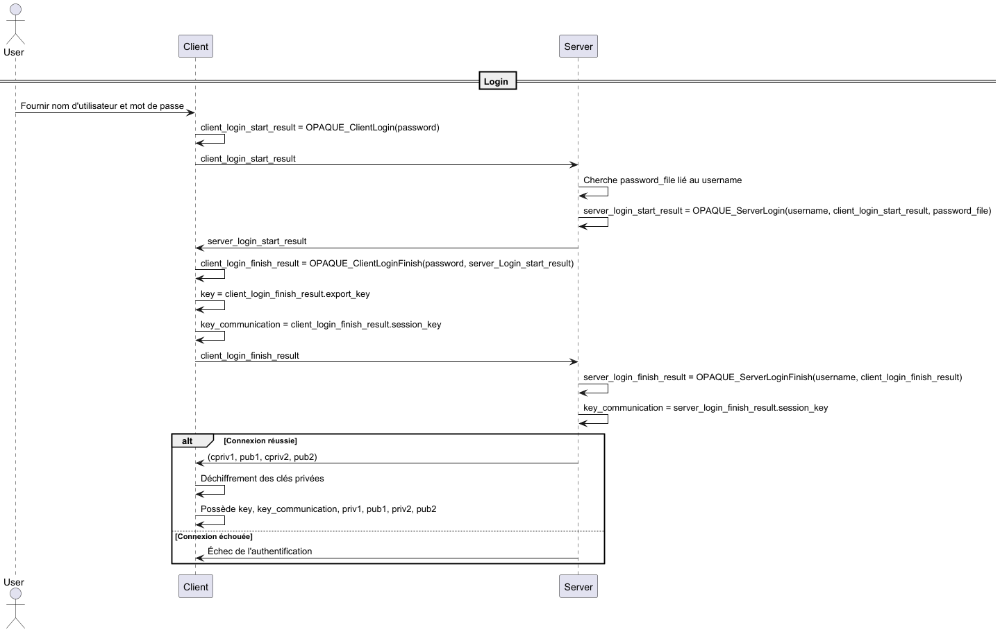
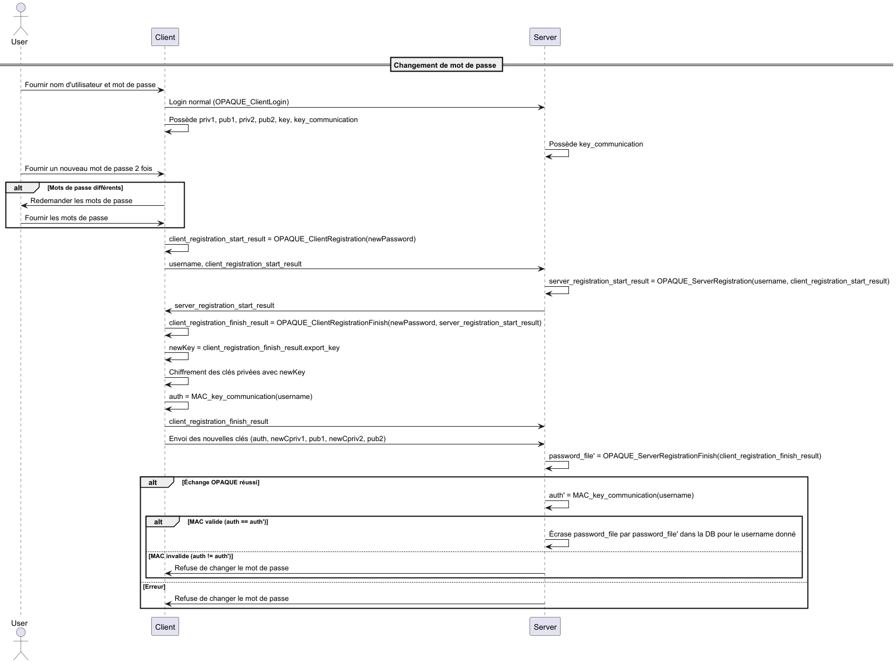

# CAA-Project Ferrara Justin

## Niveau de sécurité choisi
Dans ce projet, j'ai choisi de partir sur un niveau de sécurité de 256 bits pour la cryptographie symétriques:
- cryptographie symétrique: 256 bits
- Hash : 512 bits
- Taille clés pour courbes elliptiques : 512 bits

## Contraintes client
- Le client dispose uniquement de son nom d'utilisateur et son mot de passe.
- Le client doit pouvoir changer son mot de passe
- Le client doit pouvoir envoyer des fichiers confidentiels à un autre utilisateur avec une date d'ouverture.
- Le fichier doit être téléchargeable par le client avant la date d'ouverture
- Il ne doit pas être possible de lire le fichier avant la date d'ouverture
- Le client ne doit pas pouvoir répudier les messages envoyés
- Les messages envoyés sont authentifiés

## Contraintes serveur
- Le serveur est honnête mais curieux

## Algorithmes utilisés
- OPAQUE pour obtenir 2 clé symétrique. Une dérivée du mot de passe nommée `key` et une partagée avec le serveur pour authentifier le client nommée `key_communication`. Les algorithmes utilisés pas OPAQUE sont les suivants :
	- `Ristretto255` pour l'OPRF (Oblivious Pseudo-Random Function)
	- `Ristretto255` pour le groupe KE
	- `Triple D-H` pour l'échange de clés
	- `Argon2` pour la KSF avec les paramètres par défaut
- `XSalsa20` avec `Poly1305` comme mac pour le chiffrement symétrique des clés asymétriques. Cette combinaison d'algorithme sera nommée `SymEnc` ou `SymDec`
- `X25519`,` XSalsa20` et `Poly1305` pour le chiffrement hybride et la signature des certaines parties du message. Cette combinaison d'algorithme sera nommée `HybEnc` ou `HybDec`
- `EdDSA` pour la signature du message.
- `TLS 1.3` pour protéger la confidentialité, l'authenticité et l'intégrité de toutes les communication entre le client et le serveur.

## Gestion des clés
- Chaque utilisateur possède un mot de passe.
- Chaque utilisateur possède 1 clé symétrique de 256 bits nommée `key` dérivée du mot de passe. Cette clés est disponible à la fin de l'échange OPAQUE avec le serveur. Elle est déterministe et sert à chiffrer et déchiffrer les clés asymétriques privées.
- Chaque utilisateur possède 1 clé symétrique de 256 bits nommée `key_communication`. Dérivée de l'échange OPAQUE avec le serveur, non-déterministe. Elle sert à authentifier le client auprès du serveur pas la suite.
- Chaque utilisateur possède 1 clé asymétrique de 512 bits pour le chiffrement des messages (priv1, pub1).
- Chaque utilisateur possède 1 clé asymétrique de 512 bits pour la signature des messages (priv2, pub2).

## Tailles des clés
### OPAQUE
- La sortie de OPAQUE pour la clé `key` est de 512 bits
- La deuxième sortie de OPAQUE pour la clé `key_communication` est de 512 bits
### XSalsa20 et Poly1305 (SymEnc / SymDec)
- La clé symétrique de `XSalsa20` est de 256 bits
- Le nonce de `XSalsa20` est des 192 bits
- `Poly1305` key nonce ???
###  X25519, XSalsa20 et Poly1305 (HybEnc / HybDec)
- La taille de la clé asymétrique de `X25519` est de 512 bits
- La clé symétrique de `XSalsa20` est de 256 bits
- Le nonce de `XSalsa20` est des 192 bits
- `Poly1305` key nonce ???
### Signature
- `EdDSA` utilise une des paires clés asymétriques de 512 bits.

## Considérations
### Nonce
Tous les nonce utilisés dans ce programme font 192 bits et sont choisis de manière aléatoire. En sachant cela, on peut calculer que la probabilité de collision sur un nonce reste acceptable en jusqu'à `2^80` messages pour le chiffrement hybride. En faisant un rapide calcul, on se rend compte que si un utilisateur envoie un message toute les millisecondes, il lui faudra environ 38'000 milliards d'années pour atteindre les `2^80` message. C'est pourquoi dans ce programme je ne garde pas un historique du nombre de messages envoyés pour faire une rotation des clés si le nombre devient trop grand, car ce nombre est impossible à atteindre dans cette situation.

### Taille du fichier max
Dans ce cas, j'utilise `XSalsa20` pour chiffrer les fichiers. `XSalsa20` utilise un compte interne de block de 64 bits. En sachant que chaque bloc fait 512 bits, cela veut dire que on peut chiffrer un fichier de cette taille:
$$
tailleMaxBit= 2^{64} * 2^{9} = 2^{73}
$$
$$
tailleMaxByte = 2^{64} * 2^{9} / 2^{3} = 2^{70}
$$
On constate donc que on aura jamais un fichier de cette taille, car c'est impossible à stocker sur une machine client qui correspond à notre use case. C'est pourquoi dans le code je ne contrôle pas la taille du fichier max.

### Gestion de l'aléatoire
Nous avons besoins de générer des flus de bits aléatoire dans ce projet, notamment pour la génération des nonces. Pour ce faire, j'utilise la fonction `randombytes_buf`. Cette fonction utilise un PRNG ou TRNG en fonction de l'os utilisé:
- `RtlGenRandom()` pour Windows
- `/dev/urandom` sur Linux
- `arc4random()` ou `getrandom` pour FreeBSD
- ...
## Modélisation des adversaires
- Le système doit être protégé contre les adversaires actifs
- Les messages envoyé doivent être non répudiables
- Le serveur est honnête mais curieux
## Légendes
- utilisateur : personne physique utilisant la machine
- client : ordinateur, machine que l'utilisateur utilise
- serveur : serveur
## Création de compte
- L'utilisateur renseigne un nom d'utilisateur et 2 mot de passe identiques.
- Le client vérifie que le premier mot de passe est le même que le second, si ce n'est pas le cas, il redemande un mot de passe.
- Le client fait un échange OPAQUE avec le serveur :

$$
Client:
client\_registration\_start\_result = OPAQUE_{ClientRegistration}(password)
$$
$$
Server:
server\_registration\_start\_result  = OPAQUE_{ServerRegistration}(username, client\_registration\_start\_result)
$$
$$
Client: client\_registration\_finish\_result = OPAQUE_{ClientRegistrationFinish}(password, server\_registration\_start\_result)
$$
$$
Client: key = client\_registration\_finish\_result.export\_key
$$

- Le client génère 2 clés asymétriques de 512 bits 
$$
priv1 = random[0..512]
$$
$$
pub1 = priv1*G
$$
$$
priv2 = random[0..512]
$$
$$
pub2 = priv2*G
$$
- Le client chiffre priv1 et priv2 avec `SymEnc` en utilisant sa clé `key`, ce qui donne :
$$
IV1 = random[0..192]
$$
$$
cpriv1||tag1 = SymEnc_{key}(IV1, priv1)
$$
$$
IV2 = random[0..192]
$$$$
cpriv2||tag2 = SymEnc_{key}(IV2, priv2)
$$
- Le client termine l'échange OPAQUE en envoyant également les clés asymétriques `cpriv1`, `pub1`, `cpriv2` et `pub2`:
$$
Server:
password\_file  = OPAQUE_{ServerRegistrationFinish}(username, client\_registration\_finish\_result, cpriv1 || tag1 || IV1, pub1, cpriv2 || tag2 || IV2, pub2)
$$
- Le serveur associe `password_file` avec le username et les clés asymétrique uniquement si l'échange OPAQUE a réussi.
- Si il existe déjà un username dans la base de donnée, le server refuse d'écrire `password_file`

> Note: pour le cas ou le username existe déjà, voire la partie `Registration` pour plus de détail.

### Schéma récapitulatif

## Login
- Le client renseigne son nom d'utilisateur et son mot de passe.
- Le client fait un échange OPAQUE avec le serveur :
$$
Client:
client\_login\_start\_result = OPAQUE_{ClientLogin}(password)
$$
- Le serveur va chercher le password file en lien avec le username
$$
Server:
server\_login\_start\_result  = OPAQUE_{ServerLogin}(username, client\_login\_start\_result, password\_file)
$$
$$
Client: client\_login\_finish\_result = OPAQUE_{ClientLoginFinish}(password, server\_Login\_start\_result)
$$
$$
Client: key = client\_login\_finish\_result.export\_key\_key
$$
$$
Client: key\_communication = client\_login\_finish\_result.session\_key
$$
$$
Server:
server\_login\_finish\_result = OPAQUE_{ServerLoginFinish}(username, client\_login\_finish\_result)
$$
$$
Server: key\_communication = server\_login\_finish\_result.session\_key
$$
- Le serveur renvoie (cpriv1, pub1, cpriv2, pub2) au client à la fin de la connexion OPAQUE si la connexion a réussi.
- Le client déchiffre cpriv1 et cpriv2 avec SymDec :
$$
priv1 = SymDec_{key}(cpriv1||tag1||IV1)
$$
$$
priv2 = SymDec_{key}(cpriv2||tag2||IV2)
$$
- Le client contrôle que tag1 et tag2 sont correct
- Le client contrôle cette égalité pour s'assurer que la clé publique n'a pas été modifiée :
$$
priv1 * G = pub1
$$
- Le client possède donc :
	- key
	- key_communication
	- priv1
	- pub1
	- priv2
	- pub2

### Schéma récapitulatif

## Changement de mot de passe
- Le client fait un login normal.
- Le client possède donc (priv1, pub1, priv2, pub2, key, key_communication).
- L'utilisateur renseigne son nouveau mot de passe.
- Le client fait un échange OPAQUE comme dans registration avec le serveur :
$$
newKey = OPAQUE_{register}
$$
- Le client chiffre priv1 et priv2 avec SymEnc et newKey :
$$
IV1 = random[0..95]
$$$$
cpriv1||tag1 = SymEnc_{newKey}(IV1, priv1)
$$$$
IV2 = random[0..95]
$$$$
cpriv2||tag2 = SymEnc_{newKey}(IV2, priv2)
$$
- Le client envoie au server les nouvelles clés comme dans la partie registration `ServerFinishRegistration`.

> On notera que comme l'utilisateur existe déjà dans la base de données, le serveur vérifie que l'utilisateur est bien en possession de la clé `key_communiction` en vérifiant le MAC :
$$

auth = MAC_{key\_communication}(username)
$$
- Si le MAC est juste, alors le serveur accepte de changer le `password_file` dans la base de données, à la fin de l'échange dans server_registration_finish.

### Schéma récapitulatif

## Envoi de Message
- Le client fait un login normal.
- Le client possède donc (priv1, pub1, priv2, pub2, key, key_communication)
- L'utilisateur rentre le destinataire, le fichier à envoyer et le timestamp auquel le destinataire pourra l'ouvrir.
- Le client génére un le MAC :
$$
auth = MAC_{key\_communication}(username)
$$
- Le client demande la clé publique du destinataire du Message au serveur en envoyant son username et le MAC.
- Le serveur vérifie le MAC avec sa clé key_communication et renvoie la clé publique correspondante `pub1Dest`.
- Le client utilise `HybEnc` pour chiffrer le fichier et le nom de fichier en utilisant la clé publique du destinataire :
$$
nonceFilename = random[0..192]
$$
$$
nonceFile = random[0..192]
$$
$$
cipher1 = HybEnc(filename, nonceFilename, pub1Dest, priv1)
$$
$$
cipher2 = HybEnc(file, nonceFile, pub1Dest, priv1)
$$
- Le client signe le fichier chiffré, le nom de fichier chiffré, le nonceFilename, le sender, le receiver et la date autorisée d'ouverture du Message avec priv2 :
$$
signature = EdDSA_{priv2}(sender, receiver, timestamp, nonceFilename, filename, file)
$$
- Le client vérifie si la signature est correcte
- Le client envoie au serveur :
	- sender
	- MAC(sender)
	- receiver
	- timestamp
	- nonceFilename
	- cipherFilename
	- nonceFile
	- cipherFile
- Le serveur accepte de recevoir le message si le MAC est correct.

### Schéma récapitulatif

## Réception de Message
- Le client fait un login normal.
- Le client possède donc (priv1, pub1, priv2, pub2, key, key_communication)
- Le client fait une demande pour recevoir ses message en envoyant son username avec le MAC :
 $$
auth = MAC_{key\_communication}(username)
$$
- Le serveur vérifie si auth est juste, si c'est le cas, il renvoie tous les message au destinataire de la manière suivante:
	- Si le timestamp du message est dans le passé alors le serveur envoie :
$$
sender, receiver, timestamp, nonceFilename, cipherFilename, nonceFile, cipherFile, timePuzzle
$$
	- Si le timestamp est dans le futur, le serveur envoie tout mais met `nonceFile` à 0:
$$
sender, receiver, timestamp, nonceFilename, cipherFilename, 0, cipherFile, timePuzzle
$$
> Dans le cas où le client à le droit de déchiffrer le message et que donc il est en possession du nonceFile, le serveur renvoie quand même un timePuzzle qui ne sert à rien. C'est pour simplifier l'implémentation.
> 
- Le client reçoit le message du serveur.
- Le client vérifie que la signature du Message est correcte :
$$
signature' = EdDSA_{pubSender}(sender, receiver, timestamp, nonceFilename, filename, file)
$$
$$
signature = siganture'
$$
- Le client check si le nonceFile vaut 0:
	- si c'est le cas le client propose à l'utilisateur de déchiffrer localement en utilisant le time lock puzzle. Le client va donc ensuite commencer les calculs pour retrouver le nonceFile. Le nonceFile sera trouvé quand le time lock puzzle sera résolu, ce qui devrait prendre le même temps que d'attendre que le temps s'écoule et demander le nonceFile au serveur.
	- sinon le client écrit sur le disque le fichier chiffré sans pouvoir le déchiffrer. Il peut cependant déjà mettre le bon nom de fichier comme il a en sa possession filename et nonceFilename. Il peut également indiquer la date à laquelle le message pourra être déchiffré.
- Si le nonceFile ne vaut pas 0, le client déchiffre le Message m :
$$
m = HybDec(priv1, pubSender)
$$

### Schéma récapitulatif

## Types d'adversaires
- **Adversaires Actifs** :   
  - **Signatures Numériques** : Les messages sont signés avec les clés privées des utilisateurs, empêchant ainsi la répudiation et garantissant l'authenticité des messages. 
  - **Utilisation de TLS 1.3** : Toutes les communications entre le client et le serveur sont sécurisées avec TLS 1.3, protégeant les données en transit contre les interceptions et les modifications.  
- **Serveur Honnête mais Curieux** :   
  -  **Chiffrement de Bout en Bout** : Les messages sont chiffrés de bout en bout avec en utilisant du chiffrement hybride. Ce qui empêche le serveur d'en lire le contenu.
  - **Stockage Sécurisé des Clés** : Les clés privées des utilisateurs sont stockées chiffrées sur le serveur, empêchant l'accès non autorisé même en cas de compromission du serveur.
  - **Échange de clés authentifié** : L'utilisation de OPAQUE permet d'authentifier les utilisateurs, sans sortir le sel du serveur ce qui permet de ne pas avoir d'attaque à sel connu. Cela permet également de dériver une clé secrète côté client, et un clé symétrique partagée avec le serveur pour authentifié les requêtes suivantes provenant du client.

## Bonus
### OPAQUE
OPAQUE est utilisé ici pour divers aspects:
- authentification du client avec le mot de passe
- mitiger les attaques par sel connu
- dérivation d'un clé à partir du mot de passe
- dérivation d'un clé de session disponible côté client et serveur pour authentifier les actions du client

### Time lock puzzle
Pour permettre de déchiffrer un message au client, sans accès au serveur après l'avoir téléchargé avant la date d'ouverture, j'ai utilisé un time lock puzzle.

le time lock puzzle permet de trouver le nonceFile de manière complétement offline et ainsi de déchiffrer le fichier. Comme notre nonce fait 24 bytes et que la librairie utilisé permet de faire des time lock puzzle sur des entiers de 8 bytes, on doit faire 3 time lock puzzle.

Un seul time lock puzzle doit prendre le temps nécessaire jusqu'à la date de libération du fichier. Comme on en a 3, il faut les résoudre en parallèle sur la machine cliente.

> Note: Il est très important de noter qu'il faut résoudre les 3 puzzle en parallèle et non en série. En effet, si on les résous en série, une implémentation malveillant du client qui les résoudrais en parallèle permettrait de résoudre le puzzle 3 fois plus vite.
#### Paramètres
- Le lambda choisi dans mon cas est 256. Car c'est le niveau de sécurité choisi pour les clés symétriques.
- Le `TIME_HARDNESS` a été mis à 340'000, ce qui correspond à un temps de 1 secondes pour résoudre le puzzle avec un lambda de 256 sur ma machine.
#### Points à prendre en compte
- Trouver nonceFile à partir du time lock puzzle est une opération qui doit se faire sans s'arrêter et qui donc peut paralyser la machine client
- Trouver nonceFile à partir du time lock puzzle est une opération qui prend beaucoup de ressources machines.
- La vitesse pour trouver nonceFile dépend de la puissance de calcul de la machine cliente. On peut avoir des différence significative entre la meilleure machine du marché et la pire. C'est pourquoi  `TIME_HARDNESS` doit être choisi de manière correcte pour correspondre au client qui résoudra le time lock puzzle. Dans ce cas, comme les messages sont envoyé et reçu sur la même machine, le  `TIME_HARDNESS` reste le même partout.
- La génération du time lock puzzle côté serveur peu prendre un peu de temps. C'est pourquoi il y a un petit délai quand on veut recevoir les messages, cela correspond en temps que prend le serveur à générer un time lock puzzle différent pour chaque message qui n'on pas encore le droit d'être ouvert.